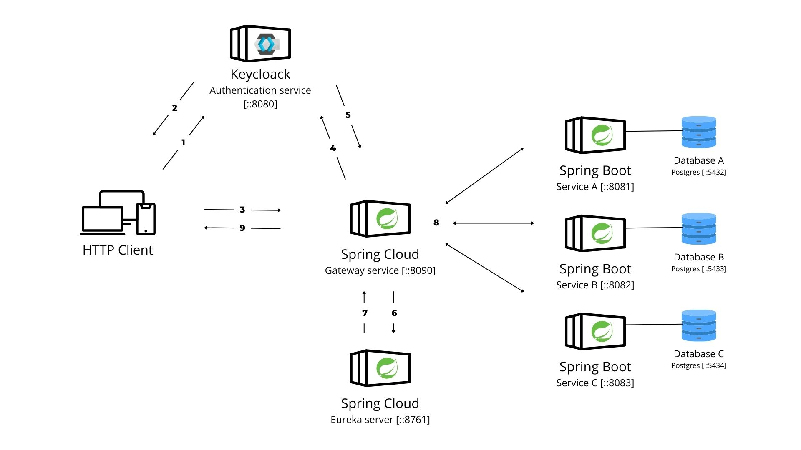

# Microservices Architecture

**_last update:_** 2023-11-07

- [Microservices Architecture](#microservices-architecture)
  - [Schema](#schema)
    - [Schema explanation](#schema-explanation)
  - [Introduction](#introduction)
    - [Communication Protocol](#communication-protocol)
    - [Authentication and security](#authentication-and-security)
    - [IP resolvment and load balancing](#ip-resolvment-and-load-balancing)
    - [Database per Service](#database-per-service)
    - [Resilience Considerations](#resilience-considerations-)

## Schema

### Schema explanation

1. The user sends a request to the Keycloak server to get an token access or if he already has one, he sends it to the API Gateway (step :3).

2. The Keycloak server sends back an access token to the user, to get more information about authentification workflow here #TODO :(define auth schema).

3. The user sends a request to the API Gateway with his access token to get specific ressources.

4. The API Gateway first controls the validity of the access token, using issuer-uri from the Keycloak server.

5. Keycloack server sends back the validity status of the token to the API Gateway.

6. If the token is valid, the API Gateway contacts the Eureka server to get the IP address of the microservice that the user wants to access.

7. Eureka server sends back the IP address of the microservice to the API Gateway.

8. The API Gateway sends the request to the microservice.

9. The microservice sends back the response to the API Gateway.

## Introduction

This architecture is mainly build with `JAVA 17` and `Spring Boot 3.1.5` . It is composed of 4 microservices : Jobs, Profiles, Offers Recommandations, Ratings #AMODIFIER. All the microservices are connected to a `PostgreSQL` database. The microservices are only accessible through `Spring boot gateway`.

### Communication Protocol

All communication between clients and internal services are make via the `API Gateway` using secure HTTPS calls. Spring Boot Security is used to verify the authenticity of access tokens in each request. This ensures that only authenticated and authorized users can access the ressource.

### Authentication and security

Keycloak serves as the authentication service, managing user authentication and generating secure access tokens. In our architecture, Keycloak is deployed as a separate service, using `OpenID Connect (OIDC)` to authenticate users and generate access tokens. This implementation ensures that only authorized users can access resources, providing robust security and compatibility with the OAuth2 specification. From backend side we use `Spring Boot Security` to verify the authenticity of access tokens in each request. This ensures that only authenticated and authorized users can access the ressource.

### IP resolvment and load balancing

Eureka service registry, acts as a central directory for all microservices in this architecture. Each microservice registers itself with Eureka, providing information about its instance, such as IP address and port. Eureka enables client-side load balancing and decouples service providers from consumers without relying on DNS.

> **_NOTE_**
> It's important to note that Eureka introduces an additional network communication layer. This can lead to a slight increase in system response time due to the communication between services and Eureka for service discovery. However, this latency is a reasonable trade-off for the substantial benefits of dynamic load balancing and the decoupling of service providers and consumers.

### Database per Service

The "Database per Service" model is employed, meaning that each service is responsible for its own database. Each service has its own REST API for interacting with its database. This provides complete data isolation between services, facilitating maintenance and scalability. The databases can be of different types depending on the needs, such as SQL, NoSQL, etc.

> **_NOTE_**
> The "Database per Service" approach, while providing data isolation and scalability, can also lead to the challenge of maintaining multiple databases. This can result in increased administrative overhead, especially when it comes to backup, monitoring, and data synchronization across services. It's essential to carefully manage and maintain multiple databases to ensure data consistency and performance.

### Resilience Considerations

In our current architecture, we have implemented Docker Compose to manage our microservices. While the services are configured to restart always in case of failures, it's essential to address a potential resilience issue. Events that are received during system failures are not currently persistently recorded within the system. This means that any incoming events during such incidents might be lost forever. To enhance the system's resilience and ensure that no critical data is lost, we may need to implement mechanisms like event logging and message queuing systems that can capture and retain incoming events, even in the face of unexpected failures. This will allow us to recover and process any missed events, ensuring data integrity and a more resilient architecture.
