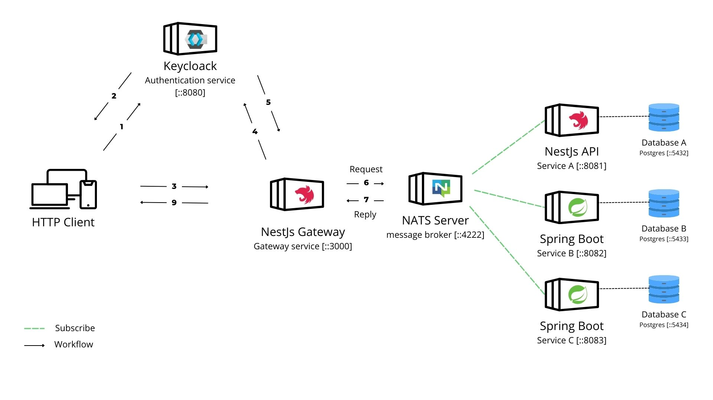

# Microservices Architecture

**_last update:_** 2022-02-24

- [Schema](#schema)
  * [Schema explanation](#schema-explanation)
- [Microservices Architecture Overview](#microservices-architecture-overview)
  * [NestJS API Gateway:](#nestjs-api-gateway-)
  * [NATS Server:](#nats-server-)
  * [Profile Service with MinIO:](#profile-service-with-minio-)
  * [Notification Service:](#notification-service-)
  * [Ad Service:](#ad-service-)
- [Communication Protocols](#communication-protocols)
- [Authentication and security](#authentication-and-security)
- [Dynamic Messaging, IP Resolution, and Load Balancing](#dynamic-messaging--ip-resolution--and-load-balancing)
- [Database per Service](#database-per-service)
- [Resilience Considerations](#resilience-considerations)
- [Shared Interface with Protocol Buffers](#shared-interface-with-protocol-buffers-)

## Schema

### Schema explanation

1. The user sends a request to the Keycloak server to get an token access or if he already has one, he sends it to the API Gateway (step :3).

2. The Keycloak server sends back an access token to the user, to get more information about authentification workflow here #TODO :(define auth schema).

3. The user sends a request to the NestJS API Gateway with his access token to get specific ressources.

4. The API Gateway sends the access token to the Keycloak server to check its validity and performed many controles as Role-based access control (RBAC), Data validation, etc.

5. Keycloack server sends back the validity status of the token to the API Gateway.

6. If the token is valid, the API Gateway sends as nats client the request/reply to NATS server in specific subject.

7. Then all nats client (microservices) which are subscribed to the specific subject, will receive the request and send back the reply to NATS server and the API Gateway will receive the reply.

## Microservices Architecture Overview

In this modern web development ecosystem, the microservices architecture has become a cornerstone for building scalable and maintainable applications. Our system comprises several independent services seamlessly working together to deliver a robust and efficient backend.

Our backend system follows a microservices approach, ensuring flexibility and scalability. Here's a quick look at the key components:

##### NestJS API Gateway:

- Manages API access, authentication, and load balancing.
- Acts as a central entry point for client-server communication.

##### NATS Server:

- Enables fast and lightweight messaging between microservices.
- Supports real-time updates and ensures efficient event handling.

##### Profile Service with MinIO:

- Handles user profiles, CVs, and profile photos.
- Utilizes MinIO for secure and scalable file storage.

##### Notification Service:

- Provides real-time updates on seasonal job offer statuses.
- Ensures timely and efficient delivery of notifications.

##### Ad Service:

- Central hub for managing advertisements, experiences, and recommendations.
- Enhances user experience through personalized content.

### Communication Protocols

All communication between clients and internal services is facilitated through the `API Gateway` using secure `HTTPS` calls. This ensures a safe and encrypted channel for data exchange, maintaining the integrity and confidentiality of information. Clients can confidently interact with our system, knowing that their data is transmitted securely over the web.

### Authentication and security

Keycloak serves as the authentication service, managing user authentication and generating secure access tokens. In our architecture, Keycloak is deployed as a separate service, using `OpenID Connect (OIDC)` to authenticate users and generate access tokens. This implementation ensures that only authorized users can access resources, providing robust security and compatibility with the OAuth2 specification. From backend side we use `NestJs-keycloack-client` to verify the authenticity of access tokens in each request. This ensures that only authenticated and authorized users can access the ressource.

### Dynamic Messaging, IP Resolution, and Load Balancing

Our microservices talk to each other using NATS, a quick and simple messaging system. NATS helps them chat fast and without getting too tangled up with each other.

NATS also helps out with figuring out where to find each service. It does this cleverly, adapting to changes in our system without needing a lot of manual fuss.

And here's the cool part – NATS makes sure no one service gets too overloaded with work. It does this using subscribers and queues, kind of like making sure everyone in a group gets a fair share of the load. This makes our whole system work better and smoother. So, NATS isn't just good at chatting; it's also like a friendly traffic cop, making sure everyone moves along nicely.

### Database per Service

The "Database per Service" model is employed, meaning that each service is responsible for its own database. Each service has its own REST API for interacting with its database. This provides complete data isolation between services, facilitating maintenance and scalability. The databases can be of different types depending on the needs, such as SQL, NoSQL, etc.

> **_NOTE_**
> The "Database per Service" approach, while providing data isolation and scalability, can also lead to the challenge of maintaining multiple databases. This can result in increased administrative overhead, especially when it comes to backup, monitoring, and data synchronization across services. It's essential to carefully manage and maintain multiple databases to ensure data consistency and performance.

### Resilience Considerations

In our current architecture, we have implemented Docker Compose to manage our microservices. While the services are configured to restart always in case of failures, it's essential to address a potential resilience issue. Events that are received during system failures are not currently persistently recorded within the system. This means that any incoming events during such incidents might be lost forever. To enhance the system's resilience and ensure that no critical data is lost, we may need to implement mechanisms like event logging and message queuing systems that can capture and retain incoming events, even in the face of unexpected failures. This will allow us to recover and process any missed events, ensuring data integrity and a more resilient architecture.

## Shared Interface with Protocol Buffers

- We've adopted Protocol Buffers (Protobuf) for shared interfaces across all services.
- Enables seamless communication by utilizing Protobuf's serialization and deserialization methods.

This addition ensures consistent and efficient data exchange between microservices, contributing to a cohesive and streamlined backend architecture.
