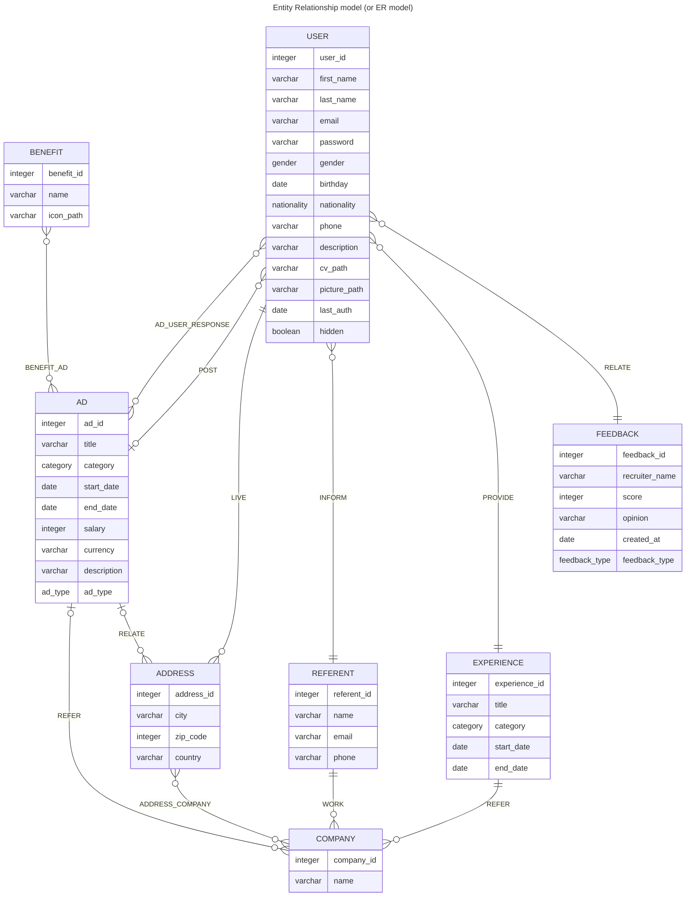

# Seasonal Workers (SW) - RDBMS

---

SW is managed by RDBMS (Relational DataBase Management System). This documentation aims to define the database schema.

This System Information (SI) represents a comprehensive platform for both seasonal workers and recruiters alike. It serves as the backbone of our software infrastructure, facilitating the seamless connection between job seekers and employers in the seasonal work industry.

## Data Modelling

### Relationship Syntax

| Value (left) | Value (right) | Meaning                       |
| :----------: | :-----------: | ----------------------------- |
|    `\|o`     |     `o\|`     | Zero or one                   |
|    `\|\|`    |    `\|\|`     | Exactly one                   |
|     `}o`     |     `o{`      | Zero or more (no upper limit) |
|    `}\|`     |     `\|{`     | One or more (no upper limit)  |

### Relationship diagrams

The database schema design follows the principles of the **third normal form (3NF)**. This approach is employed to reduce data duplication, prevent data anomalies, ensure referential integrity, and simplify data management within the database.

Conceptual Data Model

